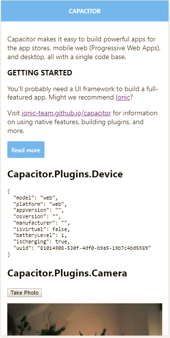

# capacitor-plugin-demos

A Capacitor project created with `npx @capacitor/cli create` with 2 added Web Components that demo 
the `Device` and `Camera` Capacitor plugins / APIs:

To play with it yourself, clone this repo and run `npm install` and then `npx cap serve`.
